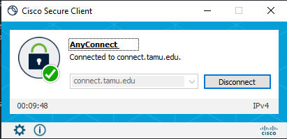
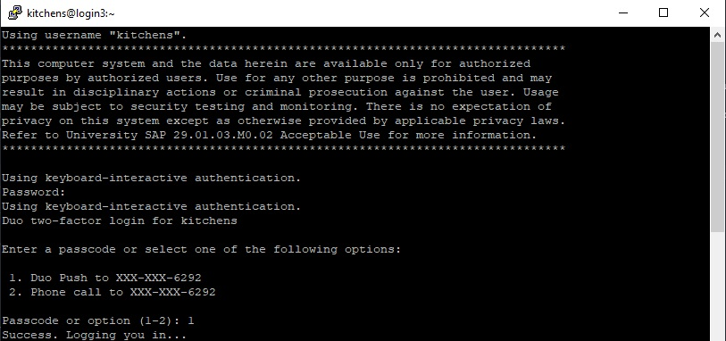
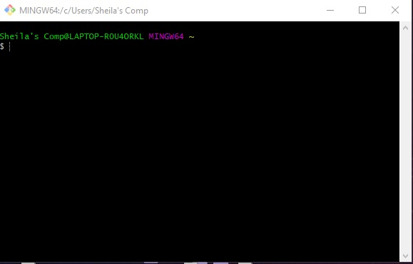

# **Account set-up for working on the TAMU HPRC**

### 1. Enroll in Two-Factor Authentication
If you are not already enrolled in Two-Factor Authentication (Du)o and/or plan to use VPN, you can enroll now at duo.tamu.edu. Enrolling is as easy as 1-2-3:

1. Choose your device and download the Duo Mobile app. (We strongly recommend the mobile app as the most user-friendly option.)
-  Android app link:https://play.google.com/store/apps/details?id=com.duosecurity.duomobile&hl=en_US

-  iOS app link: https://itunes.apple.com/us/app/duo-mobile/id422663827?mt=8

2. Start your enrollment at https://gateway.tamu.edu/duo-enroll/;

3. Remember: Once you sign up, you will need your Duo-enrolled device when you log in to most Texas A&M resources.

For more information, consult IT's knowledge base article for Duo: https://u.tamu.edu/KB0012105

### 2. Enroll in VPN connection to work off campus

To connect to the HPRC cluster login nodes off main campus (i.e., anywhere other than College Station), you need to activate the Virtual Private Network (VPN) first, then initiate a SSH connection to the cluster login nodes.

Download the Cisco AnyConnect client to your personal computer: https://connect.tamu.edu/. Credential entry will be identical to logging into other TAMU resources utilizing CAS authentication.
<p align="center"> 

### 3. Login to the HPRC environment

#### A. Windows operating system

_Option 1_: Putty (download: https://www.chiark.greenend.org.uk/~sgtatham/putty/latest.html)

1. Input your host name as your login credentials.
2. Change any appearance settings such as font size or color under the "Appearance" link on the left.
3. Save the session by clicking "Save".
4. Click on your newly saved session and press "Open". This will open up a new terminal window.
5. Input your password (hidden from view) and press Enter. A Duo push notification window will appear.


_Option 2_: Git Bash (download: https://git-scm.com/)

Instructions on installation: https://www.stanleyulili.com/git/how-to-install-git-bash-on-windows/

1. Open a new Git Bash window.


2. Type in:
```
ssh <NETID>@grace.hprc.tamu.edu
```
3. Follow the prompts for your password and DUO login.

#### B. Mac operating system

1. Open new terminal window (Applications->Utilities->Terminal).
2. Type in:
```
ssh <NETID>@grace.hprc.tamu.edu
```
3. Follow the prompts for your password and DUO login.

#### C. Linux operating system
1. Open new terminal window (Applications->Accessories->Terminal).
2. Type in:
```
ssh <NETID>@grace.hprc.tamu.edu
```
3. Follow the prompts for your password and DUO login.
