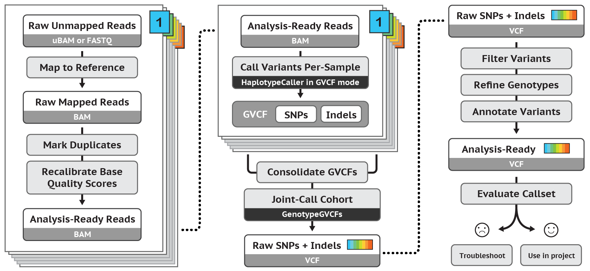

## **Variant Calling**
#### How does SNP calling and genotyping work?

Genotype estimation with likelihood approaches include **GATK** and **mpileup** (SAMtools), while **freebayes** provides Bayesian posterior probabilities.

Today we will use GATK (Fig. 3 and Fig. 4). We are focusing on the **HaplotypeCaller** program within the GATK pipeline. Calling variants with HaplotypeCaller is essentially a two-step process. First, you call genotypes individually for each sample. Second, you perform joint genotyping across samples to produce a multi-sample VCF call-set. The advantage to this strategy is that the most computationally intensive step, calling genotypes for each sample, only needs to be performed once, even if additional samples will be added later. The joint genotyping, which is less computationally intensive, can be performed as many times as needed as individuals may be added to the dataset.


Figure 3. GATK workflow.


Figure 4. GATK workflow.

The minimum options needed are a reference genome, BAM files for each sample, and output file name. Note that this process can be computationally intensive. The output for this program will be a GVCF, which has raw, unfiltered SNP and indel calls for all sites, variant or invariant. This is specified by the -ERC GVCF command, with an example below.


#### Genome/Transcriptome index for GATK
We need to create an index for picard. This already done for you!
```
#load modules
module load SAMtools/1.14
module load picard/2.25.1-Java-11

# Change me!
DIR=/scratch/group/kitchen-group/class_working_directories
USER=kitchens
REFERENCE=Cassiopea

#index the genome
samtools faidx ${DIR}/map_reference/${REFERENCE}/${REFERENCE}_genome.fa

#create genome dictionary
java -Xmx16g -jar $EBROOTPICARD/picard.jar CreateSequenceDictionary \
R=${DIR}/map_reference/${REFERENCE}/${REFERENCE}_genome.fa \
O=${DIR}/map_reference/${REFERENCE}/${REFERENCE}_genome.dict
```

#### Individual sample variant calling
The variants are identified in this step by `haploCall_update.sh`:

```
#load modules
module load GCCcore/11.2.0
module load GATK/4.2.6.1-Java-11

# Change me!
DIR=/scratch/group/kitchen-group/MARB_689_Molecular_Ecology/class_working_directories
USER=kitchens
DIR2=Project
DIR3=/scratch/user/${USER}
REFERENCE=Cassiopea

mkdir ${DIR3}/gvcfs

while read -r SAMPLE; do
        gatk SplitNCigarReads \
        -R /scratch/group/kitchen-group/MARB_689_Molecular_Ecology/map_reference/${REFERENCE}/${REFERENCE}_genome.fa \
        -I ${DIR3}/${SAMPLE}_dedup.bam \
        -O ${DIR3}/${SAMPLE}_dedup_MQ_split.bam
done < SRA.list

#variant calling for each sample
while read -r SAMPLE; do
        gatk HaplotypeCaller \
        --java-options "-Xmx48g -XX:ParallelGCThreads=8" \
        --dont-use-soft-clipped-bases true -stand-call-conf 20.0 \
        -R /scratch/group/kitchen-group/MARB_689_Molecular_Ecology/map_reference/${REFERENCE}/${REFERENCE}_genome.fa \
        -I ${DIR3}/${SAMPLE}_dedup_MQ_split.bam \
        -O ${DIR3}/gvcfs/${SAMPLE}_new.raw.g.vcf \
        -ERC GVCF
done < SRA.list
```

*Note, for low-coverage data, it is recommended to change the defaults for two options: --min-pruning 1 and --min-dangling-branch-length 1. These commands ensure that any paths in the sample graph are only dropped if there is no coverage. Otherwise the defaults of 2 and 4 respectively, will drop low-coverage regions.

### Joint genotyping across samples
Once you have run HaplotypeCaller on your cohort of samples, the resulting GVCFs need to be combined using CombineGVCFs. GenotypeGVCFs is then used to perform joint genotyping and produce a multi-sample variant call-set from your GVCF files. This tool performs the multi-sample joint aggregation step and merges the records together in a sophisticated manner: at each position of the input gVCFs, this tool will combine all spanning records, produce correct genotype likelihoods, re-genotype the newly merged record, and then re-annotate it.

You will need to make a `gvcfs.list` as so:
```
find /scratch/user/[netID]/gvcfs/ -type f -name "*.vcf.gz" > gvcfs.list
```

Then run `jg_gatk.sh`
```
#load modules
module load GCCcore/12.3.0
module load GATK/4.5.0.0-Java-17

# Change me!
DIR=/scratch/group/kitchen-group/MARB_689_Molecular_Ecology/class_working_directories
DIR2=Project
USER=kitchens
DIR3=/scratch/user/${USER}
REFERENCE=Cassiopea

# combine GVCFs
gatk CombineGVCFs \
--java-options "-Xmx16g" \
-R /scratch/group/kitchen-group/MARB_689_Molecular_Ecology/map_reference/${REFERENCE}/${REFERENCE}_genome.fa \
--variant gvcfs.list \
-O ${DIR3}/gvcfs/all_${REFERENCE}.g.vcf

# joint genotyping
gatk GenotypeGVCFs \
--java-options "-Xmx16g -XX:ParallelGCThreads=4" \
-R /scratch/group/kitchen-group/MARB_689_Molecular_Ecology/map_reference/${REFERENCE}/${REFERENCE}_genome.fa \
--indelHeterozygosity 0.01 \
-V ${DIR3}/gvcfs/all_${REFERENCE}.g.vcf \
-O ${DIR}/${USER}/${DIR2}/final_${REFERENCE}.vcf
```

### Split SNPS from INDELs
By default, GATK outputs all SNP and indel variants, but we would like to filter these separately.

Select SNPs:
```
gatk SelectVariants \
--java-options "-Xmx16g -XX:ParallelGCThreads=4" \
-R /scratch/group/kitchen-group/MARB_689_Molecular_Ecology/map_reference/${REFERENCE}/${REFERENCE}_genome.fa \
-V ${DIR}/${USER}/${DIR2}/final_${REFERENCE}.vcf \
-select-type SNP \
-O ${DIR}/${USER}/${DIR2}/final_${REFERENCE}_SNPs.vcf
```

Select Indels:
```
gatk SelectVariants \
--java-options "-Xmx16g -XX:ParallelGCThreads=4" \
-R /scratch/group/kitchen-group/MARB_689_Molecular_Ecology/map_reference/${REFERENCE}/${REFERENCE}_genome.fa \
-V ${DIR}/${USER}/${DIR2}/final_${REFERENCE}.vcf \
-select-type INDEL \
-O ${DIR}/${USER}/${DIR2}/final_${REFERENCE}_INDELs.vcf
```

### How many SNPs and INDELs?
```
#load modules
module purge
module load GCC/13.2.0
module load BCFtools/1.19
module load VCFtools/0.1.16


bcftools stats ${DIR}/${USER}/${DIR2}/final_${REFERENCE}_SNPs.vcf > ALL_${REFERENCE}_SNPs.stats
bcftools stats ${DIR}/${USER}/${DIR2}/final_${REFERENCE}_INDELs.vcf > ALL_${REFERENCE}_INDELs.stats
```

Let's look at the log files for the run.

### Filter VCF file
We would like to filter the variants such that they are "high-quality". We will focus on using hard filters, based on the GATK recommendations. Some of the parameters to consider for filtering include:
  1. QD - QualByDepth = variant quality score divided by depth of the alternative allele. Recommended SNPs= < 2.0 and indels= < 2.0
  2. FS - FisherStrand = Phred-scaled p-value using the Fisher's Exact Test for strand bias. Strand Bias tells us whether the alternate allele was seen more or less often on the forward or reverse strand than the reference allele. When there little to no strand bias at the site, the FS value will be close to 0. Higher values are more likely false positives. Recommend SNPs= > 60 and indels= > 200.
  3. MQ - RMSMappingQuality = Root Mean Square of the mapping quality of reads across samples. Recommendation: SNPs: < 40.0
  4. MQRankSum - MappingQualityRankSumTest = U-based z-approximation from Mann-Whitney Rank Sum Test for mapping qualities, comparing reads with reference bases and those with alternate alleles. Recommendation: SNPs: < -12.5
  5. ReadPosRankSum - ReadPosRankSumTest = U-based z-approximation from Mann-Whitney Rank Sum Test for distance from end of reads for those reads with an alternate allele. As bases near the ends of reads are more likely to contain errors, if all reads with the allele are near the end of the reads this may be indicative of an error. Recommendation: SNPs: -8.0, INDELS: -20.0
  6. SOR - StrandOddsRatio = High values indicate strand bias in the data. Recommendation: SNPs: 3.0, INDELS: 10.0

For SNPs:
```
#filter for biallelic sites
bcftools view -O v --threads 2 -m2 -M2 -v snps -o biallelic_snp_${REFERENCE}.vcf ${DIR}/${USER}/${DIR2}/final_${REFERENCE}_SNPs.vcf

#quality filter SNPs
bcftools filter -i 'MQ > 30 & INFO/DP < 1200 & QD > 2.0 & FS < 60.0 & MQRankSum > -12.5 & ReadPosRankSum > -8.0 & ReadPosRankSum < 10.0 & SOR < 3.0' \
--threads 2 -O v -o hqfilter_snp_${REFERENCE}.vcf biallelic_snp_${REFERENCE}.vcf

# additional filtering
vcftools --vcf hqfilter_snp_${REFERENCE}.vcf --max-missing 0.8 --minDP 6 --maf 0.05 --recode --out hqfilter_rd2_snp_${REFERENCE}

# stats on filtered file
bcftools stats hqfilter_rd2_snp_${REFERENCE}.recode.vcf > hqfilter_${REFERENCE}_SNPs.stats
```

Now how many are left??

## **Now to analyze the SNPs**
For detailed presentation on the prior and current steps, see: https://hprc.tamu.edu/files/training/2023/Spring/IntroductionToShortVariantDiscovery_2023_spring.pdf
Another useful resource: https://hprc.tamu.edu/kb/Software/Bioinformatics/Sequence_Variants/
