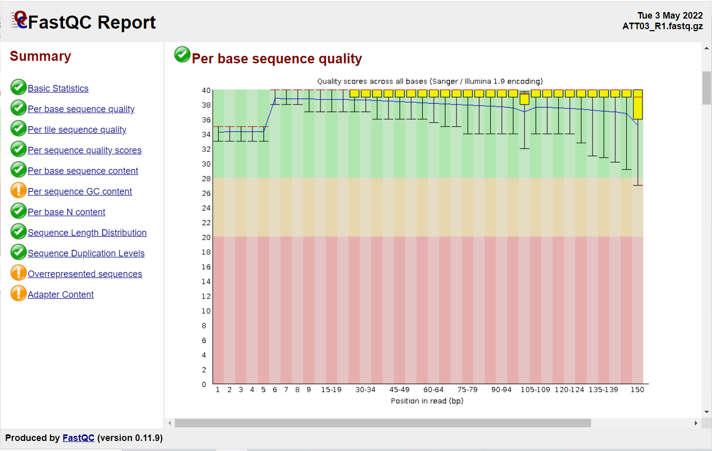

## **Read Mapping and Variant Calling- DNA version**

### 1. Read Quality Assessment
#### [FastQC v 0.11.9](https://www.bioinformatics.babraham.ac.uk/projects/fastqc/)
 With any sequencing project, it is always a good idea to first assess the quality of the data we generated. We can use FastQC for
 this purpose.

Let look at the _fastq_qual.sh_ script:
```
# load modules
module load FastQC/0.11.9-Java-11

# change me!
DIR=/scratch/group/kitchen-group/MARB_689_Molecular_Ecology/class_working_directories
USER=kitchens
DIR2=Project

#create a new directory for the fastqc report
mkdir ${DIR}/${USER}/${DIR2}/fastqc_report

#run fastqc
for SAMPLE in $(cat SRA.list); do
        fastqc -o ${DIR}/${USER}/${DIR2}/fastqc_report -f fastq -t 4 \
        ${DIR}/${USER}/${DIR2}/${SAMPLE}_1.fastq \
        ${DIR}/${USER}/${DIR2}/${SAMPLE}_2.fastq
done
```
-o = output directory
-f = fastq reads (can be fastq, bam or sam)
*Approximate run time for all data from a single sample = 2-5 mins*

Then copy the html output to your local computer (Mac version below):
```
scp username@login.hprc.tamu.edu:/scratch/group/kitchen-group/MARB_689_Molecular_Ecology/class_working_directories/kitchens/fastqc_report/example_1_fastqc.html ./
```

The html provides the summary statistics and various graphical representations of the data (Fig 2).

<p align="center"> 
Figure 2. Sequence quality per base.

### 2. Read filtering and trimming
Due to the adapter contamination found in the raw reads we need to clean them up. We can remove low quality base pairs at the tails of the reads as well as the Illumina adapters using [cutadapt v5](https://cutadapt.readthedocs.io/en/stable/index.html).

```
#load modules
module load GCCcore/13.2.0
module load cutadapt/5.0

# Change me!
DIR=/scratch/group/kitchen-group/MARB_689_Molecular_Ecology/class_working_directories
USER=kitchens
DIR2=Project

# run cutadapt v5.0
for SAMPLE in $(cat SRA.list); do
        cutadapt -a AGATCGGAAGAGC -A AGATCGGAAGAGC -m 50 -q 15 -j 0 \
        -o ${DIR}/${USER}/${DIR2}/${SAMPLE}_filtered_1.fastq \
        -p ${DIR}/${USER}/${DIR2}/${SAMPLE}_filtered_2.fastq \
        ${DIR}/${USER}/${DIR2}/${SAMPLE}_1.fastq \
        ${DIR}/${USER}/${DIR2}/${SAMPLE}_2.fastq
done
```
-a/-A = adapter sequence
-m = minimum length, reads shorter than defined length will be discarded
-q = quality trim ends of the reads at 3' end
-j = number of cores to use, if set to 0 automatically detect available num. of threads
-o = filename of the 1st read
-p = filename of the 2nd read

Recall that _**fastq**_ reads provide the sequence data from the Illumina cluster generation and quality scores for each read.
```
@HISEQ:1050:HYJCFBCX2:1:1101:2228:2472 1:N:0:ACTGAT
TTTGAAAATCGTAAAAATTGAAATATACAATTATGAACTATTTCGATATGCACTGTTAAAAATGCTACCAGATTTTTAAAAAAATATTTTAAAGCCAAAGACTTATCTTTTAAACAATGCATTATTATATTGCAAAAGTTTATCTTTTAA
+
DDDDDHIIIIIHIIIIIIIIIIIIIIIIIIIIIIHIIIIHIIHHIIIIHIIIIIIHIIIIIIIIIIIIIIIIIIIIIIIIIIIIIIIIIIIIIHIIIHGHIHIIIIIIIIIIIIIIIIIHIIIIIIIHHIIIIIIHHIFHIIIIIIIIII
@HISEQ:1050:HYJCFBCX2:1:1101:4107:2475 1:N:0:ACTGAT
TGTCATTTCATGTCATTTCATCTCATGTGCTATGTCCTGTCCTGTCCTGTCCTGTCATGTCATGTCATGTCATGTTATTTCATGTCATTTCATGTCATATGCTATGTCCTGTCCTGTCCTGTCATGTCATGTCATGTCATGTCCTGTCCT
+
DDDDDIIIIIIIIIIIIIIIIIIIIIIIIIIIHIIIIIIIIIIIIIIIHIIIHIII1CGHI1FHIH1DGHI?HHI11<1DG<FHEE1F1FH1DGHH1C<F11<1<1<<<F1<1<C1<1<D1D<1<<C11<<<<<D1D1<D<C1<D1<<<G
```

### 3. Align reads to the reference genome
Mapping of NGS reads against reference sequences is one of the key steps of the analysis. Below is a list of common mapping tools available that you might come across in the literature:

- [BWA](https://github.com/lh3/bwa) - map reads < 100 bp
- [BWA-MEM2](https://github.com/bwa-mem2/bwa-mem2)- map reads > 100 bp
- [Bowtie2](http://bowtie-bio.sourceforge.net/bowtie2/index.shtml)
- [LASTZ](https://github.com/lastz/lastz)

These read mappers compare the reads against a reference sequence that has been transformed into a highly accessible data structure called a genome index. Such indexes should be generated before mapping begins. In our case, we will use BWA-MEM.

We have already created a genome index as follows (`nano bwa_index.sh`):
```
#load correct python module
module load bwa-mem2/2.2.1-Linux64

# change me!
REFERENCE=hammerhead
DIR=/scratch/group/kitchen-group/MARB_689_Molecular_Ecology/map_reference/${REFERENCE}

# index the genome- already done for you!
bwa-mem2 index ${DIR}/${REFERENCE}_genome.fa
```

Now, we will run BWA-MEM tool on one sample like:
```
#load correct python module
module load bwa-mem2/2.2.1-Linux64
module load GCC/12.2.0
module load SAMtools/1.17

# change me!
REFERENCE=hammerhead
DIR=/scratch/group/kitchen-group/MARB_689_Molecular_Ecology/class_working_directories
DIR2=Project
USER=kitchens
DIR3=/scratch/user/${USER}

# align reads
for SAMPLE in $(cat ${DIR}/${USER}/${DIR2}/SRA.list); do
        bwa-mem2 mem -M -t 4 -R $(echo "@RG\tID:MARB689\tLB:${SAMPLE}\tPL:ILLUMINA\tPM:HISEQ\tSM:${SAMPLE}") \
        /scratch/group/kitchen-group/MARB_689_Molecular_Ecology/map_reference/${REFERENCE}/${REFERENCE}_genome.fa \
        ${DIR}/${USER}/${DIR2}/${SAMPLE}_filtered_1.fastq \
        ${DIR}/${USER}/${DIR2}/${SAMPLE}_filtered_2.fastq  \
        > ${DIR3}/${SAMPLE}_aligned.sam

        # how good was the mapping
        samtools flagstat ${DIR3}/${SAMPLE}_aligned.sam
done
```

The "-M" will mark shorter alignments as secondary that can be parsed later to remove duplicate alignments. The number of threads to use is provided by "-t". As a way to track the samples, we will assign a read group identifier using the "-R" parameter. The read group (RG) assignment for each sample requires the following information:

  - ID= read group identifier, generally takes on the flowcell + lane name and number
  - SM= sample, the name of the sample sequenced in the read group
  - PL= platform, valid values include ILLUMINA, SOLID, LS454, HELICOS and PACBIO
  - LB= library identifier, MarkDuplicates uses the LB field to determine which read groups might contain molecular duplicates, in case the same DNA library was sequenced on multiple lanes

At the end, we run [samtools flagstat tool](https://www.htslib.org/doc/samtools.html) to summarize the number of mapped reads to each category: primary, secondary, supplementary, duplicates, properly paired, singletons.

__HOMEWORK__: Make a table of number of all reads, filtered reads, mapped reads, and properly paired mapped reads.

### 4. Remove PCR Duplicates
After the tool completes, the alignments will be stored in the Sequence Alignment Map (SAM) format, a standard for storing aligned reads. The SAM format is a generic nucleotide alignment format that describes the alignment of sequencing reads (or query sequences) to a reference. We will convert the SAM file into the binary form of the format (BAM), which is compact and can be rapidly searched (if indexed).

We will use [*Picard Tools*](https://broadinstitute.github.io/picard/command-line-overview.html) to sort the SAM file by coordinates and convert it into the BAM format.

Preparation of sequencing libraries for technologies such as Illumina (used in your study) typically involves PCR amplification. Duplicates can be identified based on their outer alignment coordinates or using sequence-based clustering. One of the common ways for identification of duplicate reads is `MarkDuplicates` utility from *Picard Tools* package. It is designed to identify both PCR and optical duplicates. It is not recommended that we actually remove the duplicate sequences from the file, but simply to mark the flags appropriately in the BAM file, so that those sequences are ignored downstream. At this step you can merge together any BAM files from the same sample that are currently separated.

Run MarkDuplicates tool on the BAM files. This tool with have two outputs, a new BAM file with duplicates marked and a metric file about the original BAM. Once again we will sort and index the resulting BAM file.

```
#load modules
module load picard/2.25.1-Java-11

# change me!
DIR=/scratch/group/kitchen-group/MARB_689_Molecular_Ecology/class_working_directories
DIR2=Project
USER=kitchens
DIR3=/scratch/user/${USER}

# add read group and sort the file
for SAMPLE in $(cat SRA.list); do
        java -Xmx16g -jar $EBROOTPICARD/picard.jar AddOrReplaceReadGroups \
        I=${DIR3}/${SAMPLE}_aligned.sam O=${DIR3}/${SAMPLE}_rg_added_sorted.bam \
        SO=coordinate \
        RGID=MARB689 RGLB=${SAMPLE} RGPL=ILLUMINA RGPM=HISEQ RGSM=${SAMPLE}

        # index the resulting bam file
        java -Xmx16g -jar $EBROOTPICARD/picard.jar BuildBamIndex \
        I=${DIR3}/${SAMPLE}_rg_added_sorted.bam

        # remove duplicates
        java -Xmx16g -jar $EBROOTPICARD/picard.jar MarkDuplicates \
        TMP_DIR=${DIR3}/ \
        I=${DIR3}/${SAMPLE}_rg_added_sorted.bam \
        O=${DIR3}/${SAMPLE}_dedup.bam \
        METRICS_FILE=${DIR3}/${SAMPLE}_dedup.metrics_test.txt \
        REMOVE_DUPLICATES=false \
        TAGGING_POLICY=All \
        CREATE_INDEX=true

        # remove prior alignment files
        rm ${DIR3}/${SAMPLE}_aligned.out.sam
        rm ${DIR3}/${SAMPLE}_rg_added_sorted.bam
done
```
